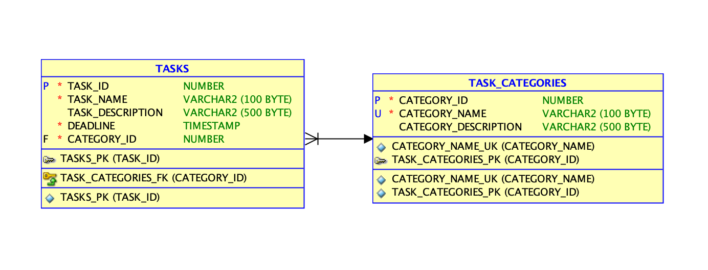

# Developer Notes

## Back End

The developed solutions e only a small demo of a fullstack implementation. 
There are a lot of improvements that can be made to into in order to make production ready:

* Adding to unit and acceptance test to all the developed endpoints
* Add a REST API documentation
* Make de Task Category a catalog defined directly in DB (currently you need to insert the tasks categories manually via REST API)
* Caching could be applied to the above step

## Front end

The front end lacks a lot of improvements regarding the user overall experience.
Some improvements might include:

- Adding a data picket. Currently, the date is inserted via text (ex. 2024-04-11T15:53:16)
- The tasks category should be a select box that gets the catalog from the backend and displays is in the frontend for selection

# Challenge 
This is a skeleton of Spring Boot application which should be used as a start point to create a working one.
The goal of this task is to create simple web application which allows users to create TODOs. In addition, the application should expose public REST API in order to allow to manipulate data programmatically.

Below you may find a proposition of the DB model:

To complete the exercices please implement all missing classes and functonalites in order to be able to store and retrieve information about tasks and their categories.
Once you are ready, please send it to me (ie link to your git repository) before  our interview.

